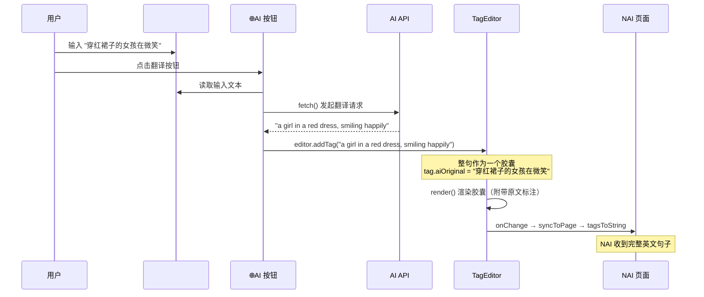

# AI 翻译功能实现方案

## 背景

用户希望在 Tag Editor 输入框旁添加 AI 翻译按钮。用户输入自然语言（如中文描述），点击按钮后调用用户自行配置的大模型 API，将输入翻译为自然语言英文句子。翻译结果作为**一个整体 tag 胶囊**插入编辑器（即使内含逗号也不拆分），同时将翻译后的英文句子同步到 NAI 页面。

## 关键技术挑战与方案

### ⚠️ 防止逗号拆分的核心问题

当前系统的数据流：
1. 用户在 `#quick-input` 输入 → [popup.js](file:///q:/Desktop/NAI/wildcards-for-novelai-diffusion/pages/popup.js) 的 [addTag()](file:///q:/Desktop/NAI/wildcards-for-novelai-diffusion/pages/popup.js#1264-1279) (L1716) 按逗号 [split(',')](file:///q:/Desktop/NAI/wildcards-for-novelai-diffusion/lib/common.js#106-132) → 每段调用 `editor.addTag()`
2. 从 NAI 页面接收 prompt → `common.splitTags()` ([splitTags.js](file:///q:/Desktop/NAI/wildcards-for-novelai-diffusion/lib/splitTags.js)) 按逗号拆分为独立 tag

翻译后的自然语言英文句子很可能包含逗号（如 `"a girl in a red dress, smiling happily"`），如果走现有的添加流程会被拆成两个胶囊。

**方案**：翻译功能**绕过** [popup.js](file:///q:/Desktop/NAI/wildcards-for-novelai-diffusion/pages/popup.js) 中的 `val.split(',')` 逻辑，直接调用 `editor.addTag(translatedText)`。因为 `TagEditor.addTag()` (L1683) 本身**不做逗号拆分**，它直接将整个字符串作为一个 `{value, disabled}` 对象 push 到 `tags[]` 数组中。这是最干净的路径。

### ⚠️ 胶囊显示：原文 + 译文

翻译胶囊将采用特殊的显示格式：
- **发送给 NAI 的值**（`tag.value`）：只保存翻译后的英文句子
- **胶囊 UI 显示**：在英文句子下方，显示原文作为翻译标注（类似现有 tag 的中文翻译行 `.tag-zh-row`）
- **存储方式**：在 tag 对象上增加 `aiOriginal` 字段保存原文，渲染时在胶囊下方显示

### ⚠️ 与 NAI 的同步

翻译后的句子通过现有 [tagsToString()](file:///q:/Desktop/NAI/wildcards-for-novelai-diffusion/pages/popup.js#2085-2143) → [syncToPage()](file:///q:/Desktop/NAI/wildcards-for-novelai-diffusion/pages/popup.js#2515-2540) 自动同步。[tagsToString()](file:///q:/Desktop/NAI/wildcards-for-novelai-diffusion/pages/popup.js#2085-2143) 会在 tag 之间插入 `, ` 分隔符，翻译句子作为一个 tag value 会被正确地作为一个整体传过去。NAI 4.5 本身支持自然语言英文输入。

---

## 需要修改的文件

### 设置存储

#### [MODIFY] [popup.js](file:///q:/Desktop/NAI/wildcards-for-novelai-diffusion/pages/popup.js)

1. **添加 AI 翻译 API 配置的存储和加载**
   - 在 `chrome.storage.local` 中存储 `aiTranslateConfig` 对象：
     ```js
     {
       provider: 'openai',     // openai | deepseek | ollama | custom
       apiKey: '',
       apiUrl: 'https://api.openai.com/v1/chat/completions',
       model: 'gpt-4o-mini',
       systemPrompt: '...'     // 默认提供一个优化过的翻译 Prompt
     }
     ```
   - 在 [initUI()](file:///q:/Desktop/NAI/wildcards-for-novelai-diffusion/pages/popup.js#1327-2006) 中加载配置并绑定设置界面的事件

2. **添加翻译触发逻辑**
   - 新增 `async function aiTranslate(inputText)` 函数
   - 使用 [fetch()](file:///q:/Desktop/NAI/wildcards-for-novelai-diffusion/injector.js#417-483) 调用 OpenAI 兼容 API（大多数国产大模型都兼容 OpenAI 格式）
   - 返回翻译后的英文自然语言
   - 翻译前显示 loading 状态，翻译后直接调用 `editor.addTag()` 插入

3. **翻译按钮事件绑定**
   - 在 [initUI()](file:///q:/Desktop/NAI/wildcards-for-novelai-diffusion/pages/popup.js#1327-2006) 中为 `#btn-ai-translate` 绑定 click 事件
   - 读取 `#quick-input` 的值 → 调用 `aiTranslate()` → 将结果通过 `editor.addTag()` 插入

4. **角色编辑器支持**
   - 同步在 [createCharacterEditor()](file:///q:/Desktop/NAI/wildcards-for-novelai-diffusion/pages/popup.js#1082-1310) 中为 `.char-btn-ai-translate` 绑定同样的事件

---

### UI 界面

#### [MODIFY] [popup.html](file:///q:/Desktop/NAI/wildcards-for-novelai-diffusion/pages/popup.html)

1. **在 `#input-area` 添加翻译按钮**（位于 Add 按钮之前）
   ```html
   <button id="btn-ai-translate" class="quick-btn" title="AI Translate">🌐AI</button>
   ```

2. **在 `#settings-modal` 添加 AI 翻译配置区域**（位于存储监控之前）
   - API 提供商选择（下拉菜单）
   - API Key 输入框
   - API URL 输入框
   - 模型名称输入框
   - 系统 Prompt 输入框（可折叠的高级设置）

3. **在 `char-prompt-template` 模板中添加翻译按钮**

---

### 编辑器组件

#### [MODIFY] [TagEditor.js](file:///q:/Desktop/NAI/wildcards-for-novelai-diffusion/lib/TagEditor.js)

1. **在 [createTagElement()](file:///q:/Desktop/NAI/wildcards-for-novelai-diffusion/lib/TagEditor.js#441-869) 中增加对 `tag.aiOriginal` 字段的渲染**
   - 如果 tag 对象有 `aiOriginal` 属性，在胶囊下方显示一行原文标注
   - 类似现有的 `.tag-zh-row` 翻译行的样式

---

### 样式

#### [MODIFY] [style.css](file:///q:/Desktop/NAI/wildcards-for-novelai-diffusion/lib/style.css)

1. 添加翻译按钮的样式（使用现有 `.quick-btn` 基础样式 + AI 专属颜色）
2. 添加翻译原文标注行的样式
3. 添加设置面板中 AI 配置区域的样式
4. 添加翻译 loading 动画样式

---

### 国际化

#### [MODIFY] [popup.js](file:///q:/Desktop/NAI/wildcards-for-novelai-diffusion/pages/popup.js) (translations 对象)

- 添加中/英/日三语翻译文本：
  - `btn_ai_translate`: "AI翻译" / "AI Translate" / "AI翻訳"
  - `setting_ai_translate_title`: "AI 翻译设置" / ...
  - `setting_ai_translate_provider`: "API 提供商" / ...
  - `setting_ai_translate_apikey`: "API Key" / ...
  - `setting_ai_translate_apiurl`: "API 地址" / ...
  - `setting_ai_translate_model`: "模型" / ...
  - `setting_ai_translate_prompt`: "系统提示词" / ...

---

## 数据流总结



---

## 默认系统 Prompt

```
You are a professional translator for NovelAI image generation. Translate the user's input into natural English that describes an image scene. Output ONLY the translated English text, nothing else. Keep the description vivid and detailed. Do not add any tags, formatting, or explanation.
```

---

## API 兼容性设计

采用 **OpenAI Chat Completions API 格式**。之所以选择这个标准：
- OpenAI / Azure OpenAI 原生支持
- DeepSeek 完全兼容
- 通义千问（Qwen）通过 dashscope 兼容
- Ollama 本地部署兼容
- Gemini/Claude/等都有兼容的代理层可用

只需用户填写 3 个参数即可工作：[apiUrl](file:///q:/Desktop/NAI/wildcards-for-novelai-diffusion/lib/common.js#490-507)、`apiKey`、`model`。

---

## Verification 验证计划

### 手动测试步骤

> [!IMPORTANT]
> 本项目为 Chrome 扩展，没有自动化测试框架。需要用户手动测试。

1. **加载扩展**：在 Chrome 中 `chrome://extensions` 打开开发者模式，加载解压的扩展文件夹
2. **打开 Popup**：点击扩展图标打开 popup 页面
3. **配置 API**：
   - 点击设置按钮 → 找到 AI 翻译设置区域
   - 填入 API Key、API URL 和模型名称
   - 关闭设置
4. **翻译测试**：
   - 在 `#quick-input` 中输入中文描述（如 "穿红裙子的女孩在公园里开心地笑"）
   - 点击 🌐AI 按钮
   - 验证：翻译后的英文句子作为一个完整胶囊出现，即使包含逗号也不会被拆分
   - 验证：胶囊下方显示原始中文输入
5. **NAI 同步测试**：在 NovelAI 页面打开 popup，执行翻译，验证翻译结果正确同步到 NAI 输入框中
6. **角色编辑器测试**：在角色编辑器中执行同样的翻译操作
7. **设置持久化测试**：关闭 popup → 重新打开 → 验证 API 配置仍然存在

### 用户建议

请确认以上方案，特别是：
1. 你有可用的 API Key 和 Endpoint 来测试吗？
2. 是否需要支持多种 API 提供商的预设（如 DeepSeek 预填 URL），还是只提供通用的 3 个输入框？
3. 翻译结果的胶囊显示原文标注这个设计是否符合你的预期？
